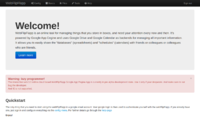
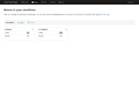
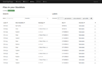
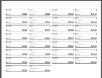

# [webflipflapp.appspot.com](https://webflipflapp.appspot.com)

This is a copy of the source code of a pdf label generating appspot app for fly stock management.

I wrote this back in 2013 to help me with printing pdf labels from google drive sheets. In case the app is useful
to you feel free to contact me.

Because Google changed terms and conditions recently for appspot and Python 2.7 reached its end-of-life in 2020,
this app might need a complete overhaul or might be taken offline in the future.

### Screenshots

### Contributing

If you want to help develop this app, get in touch via opening an issue or via email :blush:

### Install

Hello future Andreas or Josh. So to install this thing, you need to setup the google-cloud-sdk first.
Then look at the Makefile to understand what you need to do.

Good luck.
